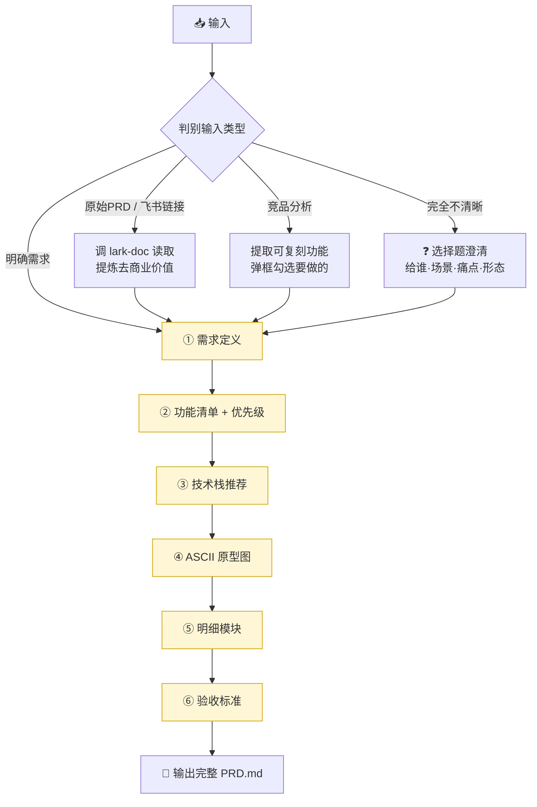

<div align="center">

# 🧩 Vibe Coding PRD Skill

**把「需求 / 原始PRD / 竞品分析」提炼成可直接发给 Claude Code / Codex 的 Vibe Coding PRD**

<br>


</div>

---

## ✨ 这是什么

一个 **Claude Code Skill**。你丢给它一段东西——不管是模糊想法、给工程师看的原始 PRD（含飞书链接），还是竞品分析——它都会**一步步跟你确认**，最后产出一份**编码 Agent 照着就能写代码**的精简 PRD（Markdown）。

> 🎯 核心理念：**不替你臆断，每一步弹框让你拍板**；产出**精简、去黑话、验收可判定**。

---

## 🚀 触发方式

在 Claude Code 里直接说：

```
帮我写一个用来 vibe coding 的 PRD
```

或者直接丢一段需求 / 原始PRD链接 / 竞品分析，并说明你想要一份给编码 Agent 的开发文档。

---

## 🔄 工作流程



> 🟡 黄色节点 = **门（gate）**：每个阶段「产出 → 弹框确认 → 通过才进入下一步」。

---

## 🧱 产出的 PRD 包含

| # | 章节 | 内容 |
|---|------|------|
| 1 | **需求定义** | 给谁 / 场景 / 解决什么问题 / 产品形态 |
| 2 | **功能清单** | 一级模块 · 二级功能 · 描述 · 优先级 · 版本（含 MVP 标注） |
| 3 | **技术栈** | 每个功能的推荐实现方式（面向技术小白，偏低代码/AI搭建） |
| 4 | **原型图** | 核心界面的 Markdown ASCII 线框 |
| 5 | **明细模块** | AI 产品 → Agent 工作流 / 提示词 / Tool 体系；传统产品 → 技术明细 |
| 6 | **验收标准** | 逐功能、可判定（「点 X → 出现 Y」，禁止「体验良好」） |

---

## ⚖️ 五条铁律

```text
1. 禁止替用户推断      —— 不确定就弹选择题，绝不脑补
2. 每步一个门          —— 产出→确认→再往下，不跳步
3. 精简去黑话          —— 只写编码 Agent 要知道的
4. 验收必须可判定      —— 点X→出现Y，禁止"体验良好"
5. 面向技术小白        —— 说人话，直接给推荐
```

---

## 📦 安装

把 `SKILL.md` 放进 Claude Code 的 skills 目录即可：

```bash
# 用户级（所有项目可用）
mkdir -p ~/.claude/skills/vibe-coding-prd
curl -sL https://raw.githubusercontent.com/864536370dhy-png/vibe-coding-prd/main/SKILL.md \
  -o ~/.claude/skills/vibe-coding-prd/SKILL.md

# 或项目级（仅当前项目）
mkdir -p .claude/skills/vibe-coding-prd && cp SKILL.md .claude/skills/vibe-coding-prd/
```

装好后，在 Claude Code 里说「帮我写一个用来 vibe coding 的 PRD」即可触发。

---

## 🗺️ 依赖

- 读取飞书原始 PRD 时会调用 **`lark-doc`** skill（可选，仅当输入是飞书文档链接时需要）。

---

<div align="center">

Made with ❤️ for **Vibe Coding** · 用 Claude Code 一句话开工

</div>
